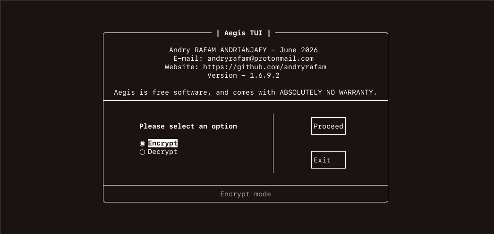

<p align="center">
  <a href="#"></a>
  <a href="#"></a>
  <a href="#"></a>
  <a href="http://opensource.org/licenses/MIT"></img></a>
</p>

<h1 align="left"> AEGIS </h1>

*Lightweight Terminal User Interface (TUI) encryption software.*

<h2 align="left"> Feature </h2>

<h4 align="left"> Supported Ciphers </h4>

- Aes256-GCM (orginal name Rijndael): https://en.wikipedia.org/wiki/Advanced_Encryption_Standard
- SM4-GCM (ShāngMì 4): https://en.wikipedia.org/wiki/SM4_(cipher)
- Twofish-EAX (Aes contest runner up developped by Bruce Schneier): https://en.wikipedia.org/wiki/Twofish
- XChaCha20Poly1305: https://en.wikipedia.org/wiki/ChaCha20-Poly1305

<h4 align="left"> KDF </h4>

- Argon2id: https://en.wikipedia.org/wiki/Argon2
 
<h4 align="left"> Tools </h4>

- Programming Language: C++ (std=17/20/23)
- Debugger: Valgrind
- cryptopp-modern: 2026.6.0 (https://cryptopp-modern.com/)
- FTXUI v-5.0.0
- GNU C++ Compiler 14.2.0 or compatible
- CMake (>= 3.22 version)

<h2 align="left"> Build and install on Linux (Debian, Fedora) </h2>

To build and install using cmake, type the following command in terminal. The executable file will be installed at /usr/local/bin/ directory.
Create and enter a temporary build directory

```json
$ cmake -B build -S .
```
Compile the executable

```json
$ cmake --build build
```
Install 'aegis' straight to /usr/local/bin

```json
$ sudo cmake --install build
```
To run on Linux, type the following command anywhere in terminal

```json
$ aegis
```

<h2 align="left"> Cleaning up </h2>

```json
$ rm -rf build/
```
To purge the installed binary from /usr/local/bin, run:

```json
$ sudo rm -f /usr/local/bin/aegis
```

<h2 align="left"> How to encrypt folders ? </h2>

To encrypt folder, first compress/archive the folder (.7z, .zip, .rar, .tar etc.) and then encrypt.

<h2 align="left"> Acknowledgement </h2>

Aegis is free software and comes with absolutely no warranty. This software is intended for personal use and educational use only. It is not suitable for industrial/professional use.

